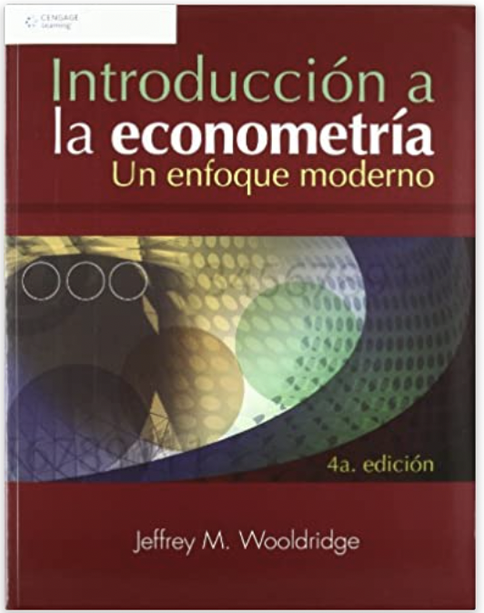
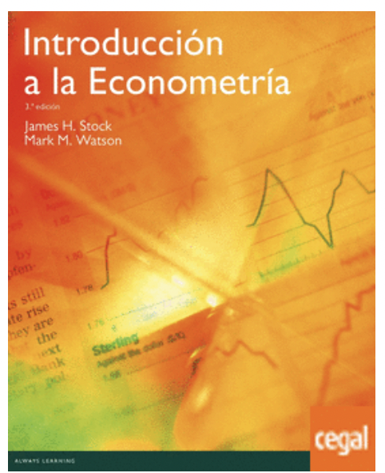
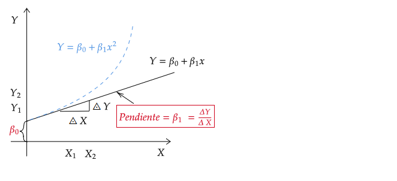
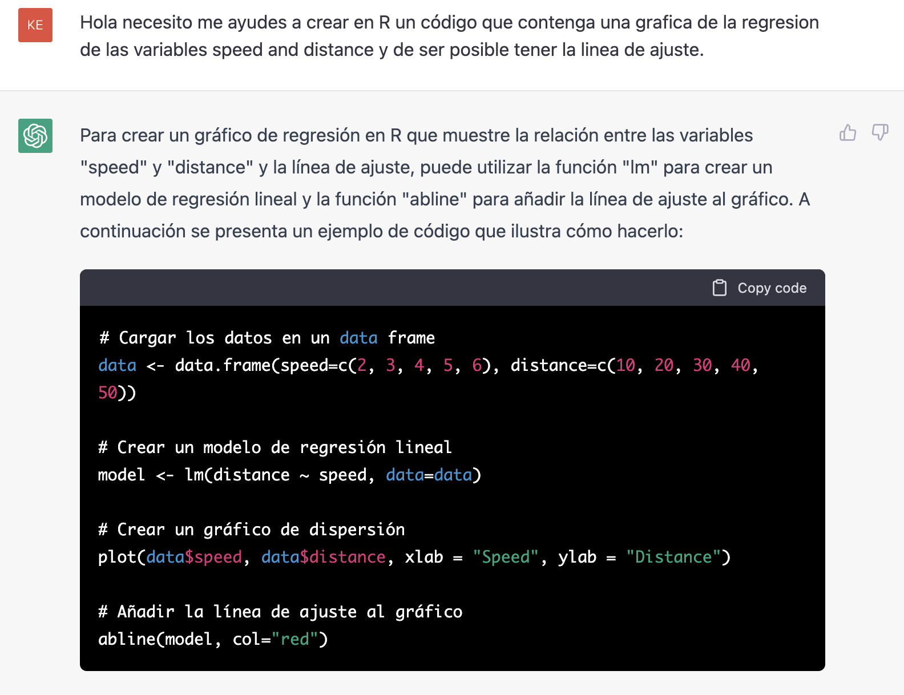

name: xaringan-title
class: left, middle


# Econometría I
<br>
## Presentación general

<br>
<br>


### Carlos A. Yanes | Departamento de Economía | `r Sys.Date()`

---
class: middle, inverse

.left-column[

# `r emo::ji("smile")`

]

.right-column[
# Bienvenido(a)s Todo(a)s
]

---

```{r Setup, include = F}
options(htmltools.dir.version = FALSE)
library(pacman)
p_load(broom, latex2exp, ggplot2, ggthemes, ggforce, viridis, dplyr, magrittr, knitr, parallel)

library(tidyverse)
library(babynames)
library(fontawesome) # from github: https://github.com/rstudio/fontawesome
library(DiagrammeR)
library(fpp2)

# Knitr options
opts_chunk$set(
  comment = "#>",
  fig.align = "center",
  fig.height = 7,
  fig.width = 10.5,
  warning = F,
  message = F
)
# A blank theme for ggplot
theme_empty <- theme_bw() + theme(
  line = element_blank(),
  rect = element_blank(),
  strip.text = element_blank(),
  axis.text = element_blank(),
  plot.title = element_blank(),
  axis.title = element_blank(),
  plot.margin = structure(c(0, 0, -0.5, -1), unit = "lines", valid.unit = 3L, class = "unit"),
  legend.position = "none"
)
theme_simple <- theme_bw() + theme(
  line = element_blank(),
  panel.grid = element_blank(),
  rect = element_blank(),
  strip.text = element_blank(),
  axis.text.x = element_text(size = 14),
  axis.text.y = element_blank(),
  axis.ticks = element_blank(),
  plot.title = element_blank(),
  axis.title = element_blank(),
  # plot.margin = structure(c(0, 0, -1, -1), unit = "lines", valid.unit = 3L, class = "unit"),
  legend.position = "none"
)
theme_axes <- theme_empty + theme(
  axis.title = element_text(size = 18),
  plot.margin = structure(c(0, 0, 0.1, 0), unit = "lines", valid.unit = 3L, class = "unit"),
)

theme_axes_math <- theme_void() + theme(
  text = element_text(family = "MathJax_Math"),
  axis.title = element_text(size = 22),
  axis.title.x = element_text(hjust = .95, margin = margin(0.15, 0, 0, 0, unit = "lines")),
  axis.title.y = element_text(vjust = .95, margin = margin(0, 0.15, 0, 0, unit = "lines")),
  axis.line = element_line(
    color = "grey70",
    size = 0.25,
    arrow = arrow(angle = 30, length = unit(0.15, "inches")
  )),
  plot.margin = structure(c(1, 0, 1, 0), unit = "lines", valid.unit = 3L, class = "unit"),
  legend.position = "none"
)
theme_axes_serif <- theme_void() + theme(
  text = element_text(family = "MathJax_Main"),
  axis.title = element_text(size = 22),
  axis.title.x = element_text(hjust = .95, margin = margin(0.15, 0, 0, 0, unit = "lines")),
  axis.title.y = element_text(vjust = .95, margin = margin(0, 0.15, 0, 0, unit = "lines")),
  axis.line = element_line(
    color = "grey70",
    size = 0.25,
    arrow = arrow(angle = 30, length = unit(0.15, "inches")
  )),
  plot.margin = structure(c(1, 0, 1, 0), unit = "lines", valid.unit = 3L, class = "unit"),
  legend.position = "none"
)

```

```{R, colors, include = F}
# Define pink color
red_pink <- "#e64173"
turquoise <- "#20B2AA"
orange <- "#FFA500"
red <- "#fb6107"
blue <- "#2b59c3"
green <- "#8bb174"
grey_light <- "grey70"
grey_mid <- "grey50"
grey_dark <- "grey20"
purple <- "#6A5ACD"
```

background-size: 100%
background-image: url(https://media.giphy.com/media/ojw15dXHEo5KSj4AEI/giphy.gif)

???

Image test. Taken from gyfty.

---
class: right, middle

# Yo

`Profesor<-c('Carlos A. Yanes')` 
`r fa('address-book')` [Carlos Andrés Yanes Guerra](https://www.linkedin.com/in/carlos-andres-yanes-guerra-0026bb31/?originalSubdomain=co)

`r fa('envelope')` [cayanes@uninorte.edu.co](mailto:cayanes@uninorte.edu.co)

`r fa('github')` [Github](https://github.com/keynes37)

`r fa('twitter')` [keynes37](https://twitter.com/keynes37)

`r fa('graduation-cap')` Profesor Asistente (Introducción a la Economía, Econometría y Microeconomía) en el Departamento de Economía ubicado en **Bloque D**.

---
# Lo importante de la sesión:

--

<span style="color:blue"> **Aprender, preguntar y seguir aprendiendo** </span>

--

Siempre tengan en cuenta:

--

- Respeto hacia los demás 
- Asistir a las sesiones presenciales en el laboratorio uninorte
- Tener presente las monitorias
- Conocer el **Syllabus** de la asignatura 
- Familiarizarse con los códigos de **R** y de [RStudio IDE](https://www.rstudio.com/products/rstudio/)

--

### Adicionalmente necesita:

--

- Poseer un usuario y cuenta en [Discord](https://discord.com) e inscribirse en el siguiente [https://discord.gg/gkGe8DbH](https://discord.gg/gkGe8DbH)

--

- Estar siempre pendiente a los *mensajes* del servidor y al **website** [https://carlosyanes.netlify.app](https://carlosyanes.netlify.app) del curso donde se irán subiendo semana a semana las presentaciones de la clase
---
# Cuando pueda vaya a Discord

--

.pull-left[
### Si no tiene una cuenta:
```{r echo = FALSE}

```
]

---
# Cuando pueda vaya a Discord

.pull-left[
### Si ya posee una, entonces:
```{r echo = FALSE}

```
]
---
# Recuerde:

--

- Es un asunto .black[académico], por ende debe tener un **nickname** que lo(a) <span style="color:blue"> **identifique** </span> como tal
- Lea bien las reglas.
- Puede ser Baneado(a) por **mal comportamiento**.
- Puede ser Baneado(a) por **NO INTERACTUAR** dentro de los canales.
- No pueden haber otros **usuarios** apartes al curso.
- NO PUEDE TENER MAS DE DOS cuentas de **USUARIOS**.
---
# Lo importante de la sesión:

--

### Los libros que se usan regularmente son:

--

.pull-left[
.grey[Introductory econometrics: A modern approach]
<br>*Wooldridge, 2010*
```{R, woold, out.width = "50%", echo = F}

```
]

.pull-right[ .blue[Introducción a la Econometría]
<br>*Stock & Watson, 2012*
```{R, cover_greene, out.width = "60%", echo = F}

```
]

---
# Instalación de elementos en su PC personal (de ser necesario)

--

## Recuerde

--

1. Descargar [R](https://www.r-project.org/).

2. Descargar [RStudio](https://www.rstudio.com/products/rstudio/download/preview/).

3. (Opcional) Descargar [Git](https://git-scm.com/downloads).

---
# A tener en cuenta
| Responsabilidad             | Tipo de trabajo      | Fecha de trabajo        | Ponderación |
|--------------------|----------------------|-------------------------|-------------|
| Primer Parcial     | Examen       | Semana del 23 de Agosto            | 20%     |
| Segundo Parcial    | Examen       | Semana del 22 de Septiembre      | 20%         |
| Workclass          | Individual y Grupal    | a lo largo del semestre | 20%         |
| Poster           | Grupal       | al final del semestre | 10%         |
| Examen final       | Examen       | Por registro académico  | 30%         |

---
# Advertencias legales

--

Los siguientes artículos del *reglamento estudiantil* son de obligatorio cumplimiento:

--


- <span style="color:red">Artículo 70</span>: Cuando el estudiante falta el 25 % de las clases, no tiene derecho a presentar el **examen final** y su nota será de 0.0 (cero punto cero).

--

- <span style="color:red"> Artículo 96</span>: Fraude tendrá penalidad de **nota de cero** ya sea en **Parcial**, **Evaluación Final**, **Taller**, **Quíz** o **actividad desarrollada en clases**. La reincidencia será entendida como el desarrollo de un proceso disciplinario con los entes de la Universidad.

--

- <span style="color:red"> Artículo 150</span>: parágrafo ... " También constituye plagio, entre otras las siguientes conductas:  (i)  hacer  uso  de  fuentes  bibliográficas  sin  mencionarlas;  (ii)  copiar  trabajos realizados por otras personas, **incluidos documentos descargados de Internet**, sin indicar de quien provienen; (iii) entregar a título individual un trabajo elaborado en grupo; (iv) comprar trabajos académicos realizados por otros

--

## Excepciones 

- <span style="color:blue"> Inasistencia</span>: Solo aquellas que estén documentadas realmente y aprobadas por el centro médico podrán solicitar supletorios.

---
class: inverse, middle, center

# Tener cuidado con ChatGPT

---
# ChatGPT

--

> ..."Se trata de uno de los sistemas de IA más capaces que hemos probado en los últimos tiempos, capaz de responder a cualquier cosa que le pidas, y de hacer muchas cosas que le solicites" ... Web (Xataka)

--

<div align="center">


</div align="center">

---
class: inverse, middle, center
background-image: url(https://upload.wikimedia.org/wikipedia/commons/3/39/Naruto_Shiki_Fujin.svg)
background-size: contain

# Generalidades

---
# Generalidades

- Este curso proporciona una introducción a la econometría utilizando elementos básicos de la **estadística** tanto inferencial como descriptiva, **álgebra matricial** y desde luego **economía**.

--

- La asignatura tiene un enfoque <span style="color:red"> **analítico - práctico** </span>  que le permite a los estudiantes entender la utilización de la *econometría* en la investigación aplicada por parte de los economistas, sus alcances y limitaciones.

---
class: inverse, middle, center
background-image: url(https://upload.wikimedia.org/wikipedia/commons/3/39/Naruto_Shiki_Fujin.svg)
background-size: contain

# ¿Por qué estamos aquí?

---
class: title-slide-section-red

# ¿Por qué estamos aquí?

--

> *Formación*: requerimos de herramientas que nos lleven a resolver preguntas de interes.

--

Ademas que:

--

> *Mercado Laboral*: Un mercado que requiere que personas tengan algunas habilidades de análisis y de conocimiento de reglas estadisticas para proponer soluciones.

---
class: inverse, middle, center
background-image: url(https://upload.wikimedia.org/wikipedia/commons/3/39/Naruto_Shiki_Fujin.svg)
background-size: contain

# ¿Qué es la econometría?

---
# Definición

Aquella **rama** de la economía que combina los estamentos de la <span style="color:red">estadística</span>, la matemática y la <span style="color:red">teoría económica</span>, con el fin de *probar* hipótesis y/o *responder* preguntas a partir de información o datos cuantitativos.

--

"*... El desarrollo de métodos estadísticos que se utilizan para estimar relaciones económicas, probar teorías económicas y evaluar e implementar políticas públicas y de negocios...*" [Wooldridge (2016) ](https://primo-tc-na01.hosted.exlibrisgroup.com/permalink/f/1nls3ib/uninorte_aleph000133994)

--

"*... La ciencia y el arte de utilizar la teoría económica y las técnicas estadísticas para analizar los datos económicos...*" [Stock & Watson (2012)](https://www.amazon.com/Introduction-Econometrics-Stock-James-Watson/dp/935286350X)

---
class: inverse, middle, center

En esta rama todo es PREGUNTAS: El(la) *investigador(a)* hace las preguntas y luego usa la **econometría** para resolverlas.

---
# La econometría

`r fa('bomb')` Es importante entender la **Econometría**
--

`r fa('bomb')` La <span style="color:red"> **Econometría** </span> utilizará los **datos** de la realidad para determinar si se comportan tal cual lo dice la <span style="color:red"> **teoría** </span>

--

- Las habilidades de los economistas son en gran forma muy distintas (y complementarias) a las demás profesiones que intentan hacer **ciencia de datos**.

--

`r fa('bomb')` La **teoría económica** nos da la dirección de los cambios.
--

- Por ejemplo: Los cambios de la demanda de celulares dado una baja (subida) de los precios.

--

- Pero **nosotros** no queremos saber solo el "cómo?" sino también el "que tanto?".

--

- Para esto se hace *necesario*:

--

    - Una **muestra** de datos.
    - La forma o **metodología** para estimar tal relación.

---
class: inverse, middle, center
background-image: url(https://upload.wikimedia.org/wikipedia/commons/3/39/Naruto_Shiki_Fujin.svg)
background-size: contain

# Un asunto muy general: el análisis de regresión

---
# Descripción

`r fa(name = "user-ninja", fill = "steelblue")` El **análisis de regresión** es una *técnica estadística* que intenta "explicar" los movimientos de una variable, denominada *variable dependiente*, como función de los movimientos de un conjunto de otras variables llamadas *variables independientes*, a través de una cuantificación o sencilla ecuación.

--

Tomemos la ecuación de referencia de la **demanda**:
$$Q= f(P, P_{s}, Y_{d})$$
--

- Para esto, $Q$ viene a ser la variable *dependiente* y las variables $(P, P_{s}, Y_{d})$ como las variables **independientes**.

--

La **econometría** permite establecer la relación teórica de una forma mas explicita<sup>1</sup>:

--

$$Q= 45 - 0.29P + 0.08P_{s} + 0.35Y_{d}$$

.footnote[
[1] Los valores y signos por lo pronto no nos interesan, después haremos énfasis en eso  
]
---
# Notación y usos
`r fa(name = "user-ninja", fill = "steelblue")` Dentro del curso se hace uso de notación matemática:

- $Y:$ Es la variable *dependiente* u *objetivo*.

- $x,z:$ Variables **independientes**, tambien le denominan explicativas, regresoras, covariables e incluso *controles*.

- $\epsilon:$ Perturbación aleatoria no observada o error.

- $\beta, \theta, \sigma^{2}:$ Los denominados **parámetros** o constantes que queremos estimar.

- $\widehat{\beta}, \widehat{\theta}, \widehat{\sigma}^{2}:$ Estimadores.

- $(i,n):$ Observaciones, tamaño de muestra.

- $y,x,z,\beta:$ Escalares, vectores.

- $X,Z:$ Matrices.
---
# Ejemplo con matrices

Tome en consideración un **conjunto** de variables $\left \{ x_{1}, x_{2},\dots, x_{k} \right\}$. Estas provienen de una muestra aleatoria de $(n)$ observaciones para cada variable. Su representación **matricial** será:

$$X= \begin{bmatrix}
x_{11} &x_{12}  &\dots  &x_{1K} \\ 
x_{21} &x_{22}  &\dots  &x_{2K} \\ 
\vdots  & \vdots  & \vdots  &\vdots  \\ 
x_{i1} &x_{i2}  &\dots  &x_{iK} \\ 
\vdots  & \vdots  & \vdots  &\vdots  \\ 
x_{n1} &x_{n2}  &\dots  &x_{nK} 
\end{bmatrix}$$
---
# Modelos lineales (un ejemplo)

El ejemplo mas sencillo es:
    $$Y_{i}= \beta_{0}+ \beta_{1}X_{i}$$
- Los (betas) son llamados "**Coeficientes**" o **Parámetros**.

--

- $\beta_{0}$ hace referencia a la *constante* o termino de intercepto.

--

- $\beta_{1}$ Es el coeficiente de la **pendiente**: La *cantidad* (magnitud) que $(Y)$ cambiará cuando $(X)$ se incremente en una unidad de medida; para un modelo lineal, $\beta_{1}$ es constante en toda la función o ecuación.
---
# Un grafico del modelo Lineal
```{r bv, out.width = "120%", echo = FALSE}

```

---
class: inverse, middle, center
background-image: url(https://upload.wikimedia.org/wikipedia/commons/3/39/Naruto_Shiki_Fujin.svg)
background-size: contain

# Quiero conocer que es `r fa("r-project", fill = "steelblue")` 

---
# `r fa("r-project", fill = "steelblue")` 

--

> R es una "calculadora" especial... contiene paquetes que han sido creados a partir de funciones para desarrollar un calculo. No es un lenguaje de programación como tal.

--

```r
# Quiero hacer una columna
carlos<-c(1,2,3,4)
```

--

Con el podemos crear objetos y trabajar con ellos. Inclusive crear funciones y automatizar algo.

--

```r
IMC <- function(edad, genero, pliegue, peso, altura) {
  # Fórmula de Faulkner para adultos
  if (genero == "masculino") {
    densidad_corporal = 1.097 - 0.00041563 * pliegue + 0.0000005804 * pliegue_cutaneo^2 - 0.0000036 * edad
  } else if (genero == "femenino") {
    densidad_corporal = 1.097 - 0.00042268 * pliegue + 0.00000077344 * pliegue^2 - 0.0000036 * edad
  } else {
    stop("El género debe ser 'masculino' o 'femenino'")
  }
# Calcular porcentaje de grasa corporal
  porcentaje_grasa_corporal = ((4.95 / densidad_corporal) - 4.5) * 100
  
  return(porcentaje_grasa_corporal)
}
```

---
# Un gráfico en `r fa("r-project", fill = "steelblue")` 

```{r cars, fig.height=4, echo=FALSE}
fit = lm(dist ~ 1 + speed, data = cars)
par(mar = c(4, 4, 1, .1))
plot(cars, pch = 19, col = 'darkgray', las = 1)
abline(fit, lwd = 2)
```
---
# Un gráfico en `r fa("r-project", fill = "steelblue")` 

--

El gráfico anterior se obtiene por ejemplo del siguiente código en **R**

--

```{r cars1, fig.height=4, eval=FALSE}
fit = lm(dist ~ 1 + speed, data = cars)
par(mar = c(4, 4, 1, .1))
plot(cars, pch = 19, col = 'darkgray', las = 1)
abline(fit, lwd = 2)
```

--

Donde `fit` es el nombre u objeto que se le da la orden que ejecute un modelo lineal `lm` cuya variable es *distancia* y es afectada por la variable de *velocidad* usando una base de datos que se denomina .black[cars]

---
# Un gráfico en `r fa("r-project", fill = "steelblue")` 

--

### Usando a ChatGPT

--

```{r echo = FALSE}

```
---
# Un gráfico en `r fa("r-project", fill = "steelblue")`

--

```{r, echo=FALSE}
library(leaflet)
df <- data.frame(
  name = c("Economia", "Edif Muvdi"),
  lat = c(1101818, 11.01934),
  long = c(-74.85010,-74.85163),
  stringsAsFactors = FALSE)
l <- leaflet(df,width = 1100, height=400) %>% 
  addTiles() %>%
  addCircleMarkers(~long, ~lat, 
				   popup = ~name,
				   stroke = FALSE,
				   fillOpacity = 1)
l
```
---
# Un gráfico en `r fa("r-project", fill = "steelblue")`

--

### R tambien hace Gráficos 3D

--

```{r echo=FALSE, message=FALSE, warning=FALSE }
library(plotly)
# Graph de volcan
fig.1 <- plot_ly(z = ~volcano)
fig.1 <- fig.1 %>% add_surface()
htmltools::save_html(fig.1, file="images/fig.1.html")
```
<iframe src="images/fig.1.html" allowtransparency="true" height="450" width="1100" scrolling="yes" style="border: none;" data-external="1"></iframe>


---
class: inverse, middle, center
background-image: url(https://upload.wikimedia.org/wikipedia/commons/3/39/Naruto_Shiki_Fujin.svg)
background-size: contain

# Y eso de... Ciencia de datos?


---
# Ciencia de datos

--

## Por qué no Excel ahora?

--

.pull-left[

]

--

.pull-right[

]
---
# Ciencia de datos

--

`r fa("angle-double-right", fill="blue")` Necesitamos ser mas dinámicos.

--

`r fa("angle-double-right", fill="blue")` Conocer nuevos ecosistemas de datos.

--

`r fa("angle-double-right", fill="blue")` Saber lo que esta del otro lado del hardware y software

--

`r fa("angle-double-right", fill="blue")` Aprender a resolver problemas.

--

<div align="center">


</div align="center">

---
# Ciencia de datos

--

.hi-blue[Primero] tiene que ver con el .hi[conjunto de herramientas] que nos provee la **matemáticas** y la **estadística** para entender la *historia* que nos brindan los .hi[datos]

--

### Algunos ejemplos

--

+ **EDA Análisis exploratorio de datos** Parte de lo preliminar, resalta lo gráfico y empezamos a entender las características de una muestra y/o población.

--

+ **Análisis de regresión** Nos permite cuantificar las relaciones entre un .hi[resultado] y un conjunto de controles y/o *variables explicativas*.

--

+ **Árboles de decisión** busca a partir de un conjunto de variables explicativas una relación "positiva/negativa" e incluso una aproximación entre algun efecto de una variable con otra.


---
# Etapas de la econometría

--

Para realizar un **análisis econométrico**, se necesita:

- Planteamiento de una pregunta.
- Revisión de la Teoría.
- Modelo económico (si existe).
- Modelo econométrico.
- Validación estadística.
- Pronósticos (si es necesario y factible).

---
class: inverse, middle, center

**Recuerde!!** En esta rama todo es PREGUNTAS. Tenemos unas mas por hacernos


---
# Algunas preguntas de econometría

--

`r fa('caret-right')` ¿Para que escribir y estimar modelos lineales?

--

`r fa('caret-right')` ¿Como elegir una variable (x) adecuada en un modelo $y=\beta x+ \epsilon$ ?

--

`r fa('caret-right')` ¿Por qué todos los modelos econométricos contienen un error $(\epsilon)$?

--

`r fa('caret-right')` ¿Qué es un **parámetro** y cual es su funcionalidad?

--

`r fa('caret-right')` ¿Por qué estimamos **parámetros** y no *variables*?

--

`r fa('caret-right')` ¿Qué es una especificación?

--

`r fa('caret-right')` ¿Qué implica que un resultado no sea significativo?

---
class: inverse, middle, center
background-image: url(https://upload.wikimedia.org/wikipedia/commons/3/39/Naruto_Shiki_Fujin.svg)
background-size: contain

# Preguntas de economía que se traen a la econometría 

---
# Preguntas que nos hacemos los economistas

--

`r fa('bolt')` ¿Un año adicional de estudio en cierta carrera *causa* un aumento en el salario (esperado) de una persona?

--

`r fa('bolt')` ¿Programas como **Ser pilo** o **Generación E** *causan* una disminución en la desigualdad?

--

`r fa('bolt')`  ¿Un aumento de la tasa de interés por parte del banco central *causa* una disminución en la inflación?

--

`r fa('bolt')` ¿Extender el IVA a los productos de la canasta familia *causa* un aumento de la pobreza y la desigualdad?

---
# Ramas de la econometría

.pull-left[
> **Teoría econométrica** "*Toma como referencia (y agrupa) todas las contribuciones enfocadas al desarrollo de herramientas y métodos y al estudio de las propiedades de los métodos econométricos. Ej: Linealidad, insesgadez, etc."*
]

--

.pull-right[
> **Econometría aplicada** "*Esta toma a todas aquellas contribuciones que usan los métodos econometrícos para estudiar problemas económicos con  ayuda de modelos económicos y datos."*
]

---
# Bibliografía

`r fa('book')` Álvarez, R. A. R., Calvo, J. A. P., Torrado, C. A. M., & Mondragón, J. A. U. (2013). *Fundamentos de econometría intermedia: teoría y aplicaciones*. Universidad de los Andes.

`r fa('book')` Stock, J. H., Watson, M. W., & Larrión, R. S. (2012). *Introducción a la Econometría*.

`r fa('book')` Wooldridge, J. M. (2015). *Introductory econometrics: A modern approach*. Cengage learning.


---
class: center, middle

# Gracias !!
Correo: `cayanes@uninorte.edu.co`
### Preguntas adicionales?


