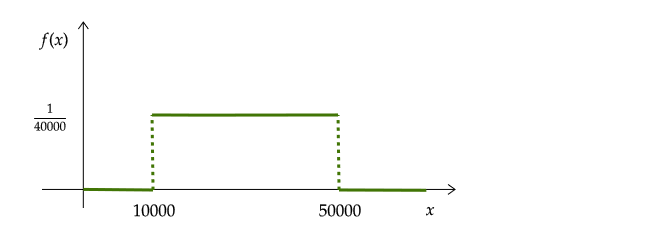
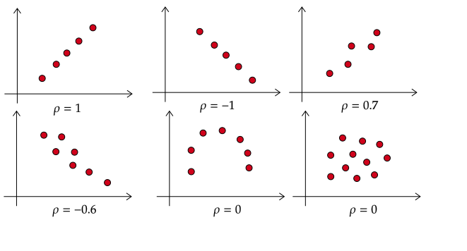
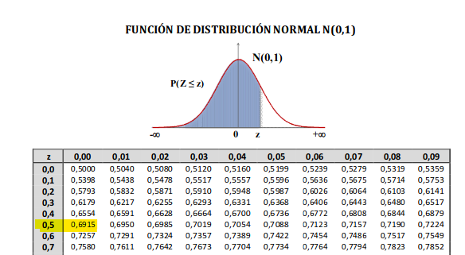

name: xaringan-title
class: left, middle


# Econometría I
<br>
## Propiedades inferenciales

<br>
<br>


### Carlos A. Yanes | Departamento de Economía | `r Sys.Date()`

---

```{r Setup, include = F}
options(htmltools.dir.version = FALSE)
library(pacman)
p_load(broom, latex2exp, ggplot2, ggthemes, ggforce, viridis, dplyr, magrittr, knitr, parallel)

library(tidyverse)
library(babynames)
library(fontawesome) # from github: https://github.com/rstudio/fontawesome
library(DiagrammeR)
library(fpp2)

# Knitr options
opts_chunk$set(
  comment = "#>",
  fig.align = "center",
  fig.height = 7,
  fig.width = 10.5,
  warning = F,
  message = F
)
# A blank theme for ggplot
theme_empty <- theme_bw() + theme(
  line = element_blank(),
  rect = element_blank(),
  strip.text = element_blank(),
  axis.text = element_blank(),
  plot.title = element_blank(),
  axis.title = element_blank(),
  plot.margin = structure(c(0, 0, -0.5, -1), unit = "lines", valid.unit = 3L, class = "unit"),
  legend.position = "none"
)
theme_simple <- theme_bw() + theme(
  line = element_blank(),
  panel.grid = element_blank(),
  rect = element_blank(),
  strip.text = element_blank(),
  axis.text.x = element_text(size = 14),
  axis.text.y = element_blank(),
  axis.ticks = element_blank(),
  plot.title = element_blank(),
  axis.title = element_blank(),
  # plot.margin = structure(c(0, 0, -1, -1), unit = "lines", valid.unit = 3L, class = "unit"),
  legend.position = "none"
)
theme_axes <- theme_empty + theme(
  axis.title = element_text(size = 18),
  plot.margin = structure(c(0, 0, 0.1, 0), unit = "lines", valid.unit = 3L, class = "unit"),
)

theme_axes_math <- theme_void() + theme(
  text = element_text(family = "MathJax_Math"),
  axis.title = element_text(size = 22),
  axis.title.x = element_text(hjust = .95, margin = margin(0.15, 0, 0, 0, unit = "lines")),
  axis.title.y = element_text(vjust = .95, margin = margin(0, 0.15, 0, 0, unit = "lines")),
  axis.line = element_line(
    color = "grey70",
    size = 0.25,
    arrow = arrow(angle = 30, length = unit(0.15, "inches")
  )),
  plot.margin = structure(c(1, 0, 1, 0), unit = "lines", valid.unit = 3L, class = "unit"),
  legend.position = "none"
)
theme_axes_serif <- theme_void() + theme(
  text = element_text(family = "MathJax_Main"),
  axis.title = element_text(size = 22),
  axis.title.x = element_text(hjust = .95, margin = margin(0.15, 0, 0, 0, unit = "lines")),
  axis.title.y = element_text(vjust = .95, margin = margin(0, 0.15, 0, 0, unit = "lines")),
  axis.line = element_line(
    color = "grey70",
    size = 0.25,
    arrow = arrow(angle = 30, length = unit(0.15, "inches")
  )),
  plot.margin = structure(c(1, 0, 1, 0), unit = "lines", valid.unit = 3L, class = "unit"),
  legend.position = "none"
)

```

```{R, colors, include = F}
# Define pink color
red_pink <- "#e64173"
turquoise <- "#20B2AA"
orange <- "#FFA500"
red <- "#fb6107"
blue <- "#2b59c3"
green <- "#8bb174"
grey_light <- "grey70"
grey_mid <- "grey50"
grey_dark <- "grey20"
purple <- "#6A5ACD"
blue_ty <- "#3b29e3"
```

background-size: 100%
background-image: url(https://media.giphy.com/media/AXorq76Tg3Vte/giphy.gif)

???

Image test. Taken from gyfty.

---
class: middle, inverse
.left-column[

# `r emo::ji("smile")`

]

.right-column[
# Preguntas de la sesión anterior?
]
---
# Variables: Clasificación básica

<ru-blockquote> _Variable aleatoria_:  Aquella que toma un **valor** numérico y su resultado esta determinado por un <span style="color:red"> **Experimento** </span>. Suelen escribirse con letras $(X, Y, Z)$ y sus resultados se hacen con minúsculas $(x, y, z)$.</ru-blockquote>

--

Un .black[_ejemplo_]: cuando se lanza un dado, $X$ viene a ser el número de veces que lo lanzamos, entonces:

--

$X= \left \{ 1, 2, 3, \cdots, 6 \right \}$ y $(x)$ puede ser 4.

--

<div align="center">


---
# Variables: Clasificación básica

--

```{r, pr1}
set.seed(123) # La opción de 1 es para una solo lanzamiento (resultado) 
sample(1:6, 1) 
```

--

Ya si quisieramos lanzar dos dados, tendriamos:

--

```{r, pr2}
set.seed(123) # Ahora queremos ver dos resultados 
sample(1:12, 2) 
```

---
# Variables: Clasificación básica 

--

Para el caso del lanzamiento de una moneda:

--

$$X = \begin{cases}  1\, =& \text{Si es cara} \\  0\, =& \text{Si es sello} \end{cases}$$
--

- La moneda tiene dos posibles **resultados**, _posiblemente encontramos la probabilidad de que la variable tome el valor de 1 si es cara con probabilidad 0.5_. Al igual que si sale sello. Ej:

--

$$P \left( X=1 \right)=0.5 \; \text{y por otro lado} \; P \left( X=0 \right)=0.5 $$

--

```{r, carsel}
set.seed(123) # Garantizar el sorteo
sample(c("Cara", "Sello"), 1) 
```

---
# Variables: Clasificación básica 

--

- **Variables discretas**: Son aquellas que provienen de una naturaleza aleatoria o _resultado_ aleatorio. Toman valores discreto de forma tal que $X:\left \{ 0,1,2,3,\cdots,245  \right \}$

--

```{r}
# Definir la función para simular un sorteo de números discretos
simulacion <- function(n, min_valor, max_valor) {
  resultado <- sample(min_valor:max_valor, n, replace = TRUE)
  return(resultado)
}
# Vamos a simular un sorteo de 10 números discretos entre 1 y 100
resultado <- simulacion(10, 1, 100)
print(resultado)
```

--

- **Variables continuas**: Aquellas que toman valores en un conjunto continuo de posibles valores. P.e.: $12.32; 114,6$

```{r}
set.seed(123)
runif(n = 10, min = 15, max = 242)
```

---
# Variables: Clasificación básica 

---
class: title-slide-section-red, middle

# Distribución 

<br>

---

# Distribución de probabilidad

--

### Conceptos

--

- La .blue[distribución de probabilidad] es una **relación** de todos los posibles valores que son posibles resultados de una variable.

--

- La .blue[probabilidad] de los sucesos suele calcularse a partir de una distribución de probabilidad.

--

- La .blue[distribución acumulada de probabilidad] resulta ser la probabilidad de que la .black[V.A] sea menor o igual a un valor concreto. 

--

| **Probabilidad de ocurrencia** |      | **Resultados** |      |      |
|:------------------------------:|:----:|:--------------:|:----:|:----:|
|                                | 0    | 1              | 2    | 3    |
| Distribución de probabilidad   | 0.6  | 0.2            | 0.16 | 0.04 |
| Distribución Acumulada         | 0.6  | 0.8            | 0.96 | 1    |


---
class: inverse
# Recuerde 😮

--

- De la ecuación y frontera de probabilidad

--

 $$p_{i}=P(X=x_{i}), \; i= 1,2,3,...,k$$
--

Donde,

--

$$0 \leq p_{i} \leq 1$$
--

<br/>
- La función de **densidad** reúne toda la información acerca de los valores de X y sus probabilidades correspondientes:

--

     $$f(x_{i})= p_{i}, \; i=1,2,3,...,k$$
---
# Distribución de una variable aleatoria discreta

--

- Una **función de densidad discreta**, es $f(x)$ una _lista_ de las probabilidades asociadas a diferentes realizaciones, $x$, que pueda tomar una variable discreta $X$:

--

$$P(W=w): \begin{cases} \frac{1}{6}& si  &w=1 \\ \frac{1}{6}& si  &w=2 \\ \frac{1}{6}& si  &w=3 \\ \frac{1}{6}& si & w=4 \\ \frac{1}{6}& si  &w=5 \\ \frac{1}{6}& si  &w=6 \\ 0& si  & ocurre\; otro\; evento \end{cases}$$ 
--

- El valor esperado del dado es: 

--

$$E(W)= 1 \times \frac{1}{6}+2 \times \frac{1}{6}+3 \times \frac{1}{6}+4 \times \frac{1}{6}+5 \times \frac{1}{6}+6 \times \frac{1}{6}=3.5$$
---
# Ejemplo de distribución discreta

--

```{r graph1, fig.height=4, dev='svg', echo=FALSE}
n=5
p=1/2
x=0:4
p=dbinom(x,size=n,prob=p)
plot(x,p,type="h",xlim=c(-1,4),ylim=c(0,1),lwd=2,col="blue",ylab="p")
points(x,p,pch=16,cex=2,col="dark red")

```


---
# Distribución de una variable aleatoria continua

--

- Una **función de densidad continua** es, $f(x)$, una función asociada a una variable continua X, de tal forma que:

--
    
$$\int_{a}^{b} f (x) dx= P( a \leq x\leq b )$$

--

Donde $f(x)$ debe cumplir:

--

  - $f(x) \geq 0$.

--

  - $\int_{-\infty}^{\infty} f(x) dx=1$

--
  
**Esto permite conocer la probabilidad de que una V.A.C se encuentre en un intervalo**.

---
# Ejemplo: Distribución Continua

`r fa('barcode')` Una <span style="color:red">**empresa**</span> después de haber realizado un estudio de la distribución del consumo de gasolina, encontró que:

--

$$f(x)=\begin{cases} \frac{1}{40000}& si  & 10000 \leq x \leq 50000 \\ 0& si  & ocurre\; lo\; contrario\end{cases}$$ 
--

(x) viene a ser la **cantidad** de gasolina que consumen sus empleados en un mes.

--

```{r pt1, out.width = "60%", echo = FALSE}

```


---
class: title-slide-section-grey
# Preguntas al público 🏆

--

## Qué pasaría si quiero conocer:

--

### 1. La probabilidad que los empleados consuman en este mes exactamente 30000 litros de gasolina

--

### 2. Por lo menos 30000 litros


--

### 3. Entre 20000 y 30000 litros de gasolina

---
# Para esto:
--

Resuelvo la integral de la **función**:
--

$$\int f(x) dx= \int \frac{1}{40000} dx=\frac{x}{40000}+C$$
--

Para la _pregunta 1_ $\Rightarrow$

--

$$P(X=30000)=P(30000 \leq x \leq 30000)$$
--
Teniendo:
$$\int_{30000}^{30000} f(x) dx= 0$$

--
_Es decir, la probabilidad que consuman 30 mil litros de gasolina es exactamente cero_.

---
# En `r fa("r-project", fill = "steelblue")` 

--

```{r}
fp <- function(x){1/40000}
Vfp <- Vectorize(fp) # Se debe aplicar
e1 <- integrate(Vfp, lower = 30000, upper = 30000)$value
e1
```


---
# Continuando:
--

Para la _pregunta 2_ $\Rightarrow$
--

$$P ( X \geq 30000)=1-P (10000 \leq x \leq 30000)$$
--
Teniendo:
$$1-\int_{10000}^{30000} f(x) dx = 1- 0.5 = 0.5$$
--

_La probabilidad es del 50% en este caso de que al menos consuman 30 mil litros_.

--

De donde salió el **0.5**? 😱

--

<span style="color:red"> $$\Biggr|_{10000}^{30000}\quad\frac{30000}{40000}-\frac{10000}{40000}=\frac{2}{4}=0.5$$ 😬</span>

--

```{r}
e2 <- 1 - integrate(Vfp, lower = 10000, upper = 30000)$value
e2
```


---
# Para lo último

Para la _pregunta 3_ $\Rightarrow$

--

$$P( 20000 \leq X \leq 30000 )=P (20000 \leq x \leq 30000)$$
--

Teniendo:
$$\int_{20000}^{30000} f(x) dx= 0.25$$
--

_La probabilidad es del 25% en este caso de que al consuman entre 20 mil y 30 mil litros de gasolina_.

--

De donde:
$$\Biggr|_{20000}^{30000}\quad\frac{30000}{40000}-\frac{20000}{40000}= \frac{1}{4}=0.25$$

--

```{r}
e3 <- integrate(Vfp, lower = 20000, upper = 30000)$value
e3
```

---
class: title-slide-section-red, middle

# Operadores 

<br>


---
# Operador: Sumatoria
--

>Simplifica de forma significativa el uso de términos en una expresión.

--

$$M_{1}+M_{2}+M_{3}+M_{4}+M_{5}+M_{6}+M_{7}$$
--

Entonces podemos escribir lo anterior como:
$$\sum_{i=1}^{7}M_{i}$$
--

Calcule el _resultado_ de la siguiente expresión:

$$\sum_{j=0}^{2}\frac{1}{(j+1)(j+3)}$$

--

El desarrollo es sencillo:

--

$$\sum_{j=0}^{2}\frac{1}{(j+1)(j+3)}=\frac{1}{1\cdot3}+\frac{1}{2\cdot4}+\frac{1}{3\cdot5}=\quad \frac{40+15+8}{120} = \frac{63}{120} $$

---
class: title-slide-section-grey, middle
#Propiedades Operador Sumatoria

Algunas de las principales:

--

1. $$\sum_{i=1}^{n}(a_{i}+b_{i})=\sum_{i=1}^{n}a_{i}+\sum_{i=1}^{n} b_{i} \quad \text{Prop. aditiva}$$

--

2. $$\sum_{i=1}^{n}ca_{i}=c\sum_{i=1}^{n}a_{i}\quad\text{Prop. de homogeneidad}$$

--

3. <span style="color:red">Una propiedad que es importante</span>:
$$\sum \limits_{i=1}^{n} c= n\;c \; ; \; \text{Prop. Constante}$$
--
Por ejemplo: $\sum_{i=1}^{4} 7=7+7+7+7=28$ 

---
# Operador Productoria

--

> Es **análogo** al operador **sumatoria**. Se plantea como lo siguiente:

--

$$\prod \limits_{i=1}^{n} a_{i}= a_{1} \times a_{2} \cdots a_{n}$$
--

Por ejemplo:

$$\prod \limits_{i=2}^{4} (3i-2)= 4\times7\times10=280$$
---
# Pequeño ejemplo en `r fa("r-project", fill = "steelblue")`

--

Con el software, es fácil de implementar las operaciones anteriores ya sea con los comandos `sum` o `prod`.

--

- Halle la sumatoria y el producto de $a=35$ donde $i:\{1,2,3,4,5\}$
  $$\sum \limits_{i=1}^{5} a_{i}, \; \text{ademas de la} \; \prod \limits_{i=1}^{5} a_{i}$$

--

```{r form1, echo=TRUE}
a<-rep(35,5)
a
sum(a)
prod(a)
```

---
# Otro ejemplo en `r fa("r-project", fill = "steelblue")` 

- Para la función 
$$\prod \limits_{i=2}^{4} (3i-2)$$
--

- Halle el respectivo **resultado**

--

De forma manual es:
$$(3)(2)-2\times(3)(3)-2\times(3)(4)-2=280$$
--

- En `r fa("r-project", fill = "steelblue")`  construiremos la formula haciendo uso de las **funciones**, para eso podemos decirle al programa que usaremos el _comando_ `function`.

---
# Funciones `r fa("r-project", fill = "steelblue")`

--

> Una función **R**, permite obtener un resultado a partir de una formula anteriormente establecida y  tiene varias partes:

--

*Primero hagamos un ejemplo simple de establecer la formula de raíz cuadrada de un valor o número*

--

```{r, obfun}
raiz = 
  function(x) { 
    raiz_x = x^(1/2)  # formula que se va establecer
    return(raiz_x) ## Resultado 
  }
```

--

*A continuación la usamos con el valor de 144*

--

```{r, prw}
raiz(144)
```

---
# Funciones `r fa("r-project", fill = "steelblue")`

--

Podemos ademas implementar otras opciones como las listas o la manera en como quiere que nos quede el resultado:

--

```{r, obfun1}
raiz = 
  function(x) { 
    raiz_x = x^(1/2)  # formula que se va establecer
    return(list(valor=x, raiz_cuadrada=raiz_x))
  }
```

--

Testeamos

--

```{r, contratest}
raiz(144)
```

---
# Funciones `r fa("r-project", fill = "steelblue")`

--

Tambien se puede con el formato `tibble` de `tidyverse` y colocar como si se tratara de una matriz.

--

```{r, obfun2}
raiz = 
  function(x) { 
    raiz_x = x^(1/2)  # formula que se va establecer
    df = tibble(valor=x, raiz_cuadrada=raiz_x) # un dataframe
    return(df)
  }
```

--

Testeamos

```{r, test1}
raiz(144)
```

--

*El resultado aparece como si fuera una tabla*

---
# Funciones `r fa("r-project", fill = "steelblue")`

--

Para el caso de 

--

$$\prod \limits_{i=2}^{4} (3i-2)$$

--

```{r cour, echo=TRUE}
caps<-function(x,y){a=3*(x:y)-2;m=prod(a);m}
# Los argumentos son X y Y, y es donde empieza y termina la productoria.
caps(2,4) # con la función
```

--

*Note que para este caso usamos (;) para separar por operación*
---
class: title-slide-section-red, middle

# Media y varianza de una distribución

<br>


---
# Media y varianza de una distribución

--

Para el caso general -esto es- para $X_i$, i.i.d para cualquier distribución:

--

$$\text{Media:}\; E(X)= \bar{X}=E \left(\frac{1}{n}\sum\limits_{i=1}^{n}X_i\right)=\frac{1}{n}\sum\limits_{i=1}^{n}E(X_i)=\frac{1}{n}\sum\limits_{i=1}^{n}\mu_x=\mu_x$$
--

Para la **Varianza** $\Rightarrow$

--

$$\begin{aligned}
\text{Varianza:} &= var(\bar{X})\\
                 &= E \left[\bar{X} - E(\bar{X})\right]^2\\
                 &= E \left[\left(\frac{1}{n}\sum\limits_{i=1}^{n}X_i \right) - \mu_x)\right]^2\\
                 &= \color{#e31612}{E \left[\frac{1}{n}\sum\limits_{i=1}^{n}(X_i  - \mu_x)\right]^2}🥲
\end{aligned}$$


---
class: title-slide-section-red, middle

# Covarianza

<br>


---
# Covarianza

--

> Una de las medidas que muestra como evolucionan dos variables.

--

$$cov(X,Y)=\sigma_{xy}= E[( X-\mu_{x}) (Y-\mu_{y})]$$

--

`r fa('exclamation-triangle')` Lo que vendría a ser:

$$\sum_{i=1}^{k} \sum_{j=1}^{l}(x_{j} - \mu_{x})(y_{i} - \mu_{y}) Pr( X=x_{j}, Y=y_{i})$$

--

**El signo** de la **covarianza** es fundamental!!

--

`r fa('exclamation-triangle')` Esto significa:

--

- <span style="color:blue"> **La dirección de la influencia de una variable sobre la otra.** </span>

--

```{r}
x <- c(4.2, 4.6, 3.8, 4.1, 4.3)  # Datos de una asignatura
y <- c(2.1, 2.4, 2.8, 2.1, 3.2)  # Datos segunda asignatura
covarianza_xy <- cov(x, y) # Formula base
print(covarianza_xy)
```


---
# Correlación

--

> Debido a que la covarianza presenta dificultades en la interpretación dado el producto de las dispersiones de variables de Y y X. Surge el concepto o medida de dependencia entre Y y X y resuelve el problema de interpretación.

--

$$Corr(X,Y)= \frac{cov( X,Y)}{\sqrt{var(x)var(y)}}=\frac{\sigma_{xy}}{\sigma_{x}\sigma_{y}}$$ 

--

`r fa('flask')` **La medida esta en un intervalo cerrado**

--

$$-1 \leqslant corr(X,Y) \leqslant 1$$

--

```{r}
correlacion_xy <- cor(x, y) # Formula correlación
print(correlacion_xy)
```

---
# Coeficiente de Correlación

--

.pull-left[ 
>Dado que la <span style="color:red"> **Covarianza** </span> depende de las unidades en que se miden las desviaciones, aparece un concepto mas estandarizado a la hora de medir relación y asociación entre un par de variables **aleatorias** y tener un concepto o interpretación mas "detallada".]

--

.pull-right[
> Es un <span style="color:red"> **estadístico** </span> que mide la relación (**signo**) y la fuerza (<span style="color:red"> _magnitud_ </span>) de asociación lineal entre dos variables.]

--

`r fa('info-circle')` La formula puede ser _re-expresada_ como:

--

$$\frac{\sum\limits_{i=1}^{n}(x_{i} - \bar{x})(y_{i}- \bar{y})}{\sqrt{ \sum\limits_{i=1}^{n} (x_{i} - \bar{x} )^{2} \sum\limits_{i=1}^{n} ( y_{i} - \bar{y})^{2}}}$$

---
# Intepretación

--

`r fa('language')` El coeficiente (**r**) no tiene unidades y solo puede tomar valores entre -1 y 1, lo que es $-1 \leq r_{x,y} \leq 1$. **Su interpretación depende del signo y magnitud que nos arroja el estadístico**.

--

- Cuando $Corr(X,Y)=1$, se dice que hay una asociación lineal perfecta y directa.

--

- Cuando $Corr(X,Y)=0$, se dice que NO hay asociación.

--

- Cuando $Corr(X,Y)=-1$, se dice que hay una asociación lineal perfecta e indirecta.

--

```{r corr, out.width = "60%", echo = FALSE}

```

---
# Recuerde 😮 

--

## Propiedades en Varianza

--

La suma de varianzas X e Y toma la expresión:

--

$$var(X+Y)=var(X)+var(Y)+2cov(X,Y)=\sigma^{2}_{x}+\sigma^{2}_{y}+2\sigma ^{2}_{xy}$$

--

Y dado el caso que las variables sean <span style="color:red"> **independientes**</span> la formula se reduce a:

--

$$var(X+Y)=var(X)+var(Y)+2cov(X,Y) =\sigma^{2}_{x} +\sigma^{2}_{y}$$

--

### Independencia lineal

--

`r fa('flask')` Dos variables _aleatorias_, X y Y, se consideran independientes si y solamente si:

--

$$E[XY]= E[X]E[Y]$$

--

- Esto no implica que no existe relación entre ellas 

---
class: title-slide-section-red, middle

# Nuevamente lo de distribución

<br>


---
# Recordeis

--

`r fa("simplybuilt", fill = "red")` Recordemos que utilizamos **funciones de densidad de probabilidad** (FDP) para describir la probabilidad de que una **variable aleatoria continua** tome un rango de valores, p.e: (El área total = 1). Estas _FDP_ caracterizan las distribuciones de probabilidad, y las distribuciones más comunes/famosas/populares reciben nombres (_p.e_, normal, *t*, Weibull, Gamma, Poisson).

--

- La probabilidad de que una variable aleatoria normal estándar tome un valor entre -2 y 0: $$\mathop{\text{P}}\left(-2\leq X \leq 0\right) = 0.48$$

--

```{R, Ejemplokd123, echo = F, dev = "svg", fig.height = 3}
# Generate data for density's polygon
tmp <- tibble(x = seq(-4, 4, 0.01), y = dnorm(x))
tmp <- rbind(tmp, tibble(x = seq(4, -4, -0.01), y = 0))
# Plot it
ggplot(data = tmp, aes(x, y)) +
geom_polygon(fill = "grey85") +
geom_polygon(data = tmp %>% filter(between(x, -2, 0)), fill = red_pink) +
geom_hline(yintercept = 0, color = "black") +
theme_simple
```
---
# Recordeis
--

+ Para el caso de hallar la probabilidad de que una variable aleatoria normal estándar tome un valor mayor a 2: $$\mathop{\text{P}}\left(X > 2\right) = 0.023$$
--
```{R, Ejemplokd1234, echo = F, dev = "svg", fig.height = 3}
# Generate data for density's polygon
tmp <- tibble(x = seq(-4, 4, 0.01), y = dnorm(x))
tmp <- rbind(tmp, tibble(x = seq(4, -4, -0.01), y = 0))
# Grafico
ggplot(data = tmp, aes(x, y)) +
geom_polygon(fill = "grey85") +
geom_polygon(data = tmp %>% filter(between(x, 2, Inf)), fill = red_pink) +
geom_hline(yintercept = 0, color = "black") +
theme_simple
```

--

En `r fa("r-project", fill = "steelblue")` 

--

```{r}
prob <- 1- pnorm(2)
prob
```


---
# Distribución Normal

--

>  **Normal estándar**:
Su forma concisa de expresión es $N(\mu, \sigma^{2})$. Lo que significa que su media, $\mu=0$ y su varianza $\sigma^2=1$.  Para buscar probabilidades de una variable normal se debe **estandarizar** la variable en cuestión restando su <span style="color:red"> **media**</span> y luego dividir el resultado por la <span style="color:red">**desviación típica**</span>.

--

`r fa('paper-plane')` **Ejemplo**: Suponga que desea calcular la probabilidad de que $Y\leq2$? cuando $N\sim(1,4)$.

--

- Para eso simplemente aplica:

--

$$Pr(Y\leq 2) =\frac{Y-1}{2}\Rightarrow\frac{2-1}{2} =\Phi ( 0.5)=0.691$$

--

`r fa('exclamation-triangle')` _La formula de la normal es_:

--

$$\text{Normal} =\frac{X-\mu}{\sigma}$$
--

- Donde $X$ es el valor a _testear_; $\mu$ es la media de la **distribución** y $\sigma$ la _desviación estandar_.  

--

`r fa('info-circle')` <span style="color:red">Mucho cuidado!!</span>: El signo u operador de $\Phi$ significa que hay que ir a buscar el valor en la <mark>tabla de la Normal</mark>.

---
# Ejemplo de valor en tabla normal

--

```{r normgrap, out.width = "60%", echo = FALSE}

```

--

En `r fa("r-project", fill = "steelblue")` es hacer uso del comando `pnorm()`, observe:

```{r pnorm}
pnorm(0.5)
```

---
# Grafico de nuestro ejemplo (normalizada)

--

```{R, ejemplojpg34, echo = F, dev = "svg", fig.height = 3.5}
# Generate data for density's polygon
tmp <- tibble(x = seq(-4, 4, 0.01), y = dnorm(x))
tmp <- rbind(tmp, tibble(x = seq(4, -4, -0.01), y = 0))
# Plot it
ggplot(data = tmp, aes(x, y)) +
geom_polygon(fill = "grey85") +
geom_polygon(data = tmp %>% filter(between(x, -3, 0.6)), fill = blue_ty) +
geom_hline(yintercept = 0, color = "black") +
annotate("text", x = -1, y = 0.05, label = "P = 0.691", color="white", size=7) +  
theme_simple
```

--

La probabilidad de $P(x\leq 2)= P(Z \leq 0.5)$ con una media de 1 y varianza de 4 es del 69%.
---
class: inverse
# Clave 📣

--

Sean $X_{1}$ y $X_{2}$ dos números tal que $X_{1} < X_{2}$

--

- Es bueno saber que hay que usar lo siguiente normalmente:

--

$$Pr( Y\leq X_{2}) =Pr( Z\leq d_{2}) =\Phi ( d_{2})$$

--

- <span style="color:red">**Es posible que ocurra o le pregunten de esto**</span>

--

$$Pr( Y\geq X_{1}) =Pr( Z\geq d_{1}) =1-\Phi ( d_{1})$$

--

- O también pase 🦸️

$$Pr( X_{1} \leq Y\leq X_{2}) =Pr( d_{1} \leq Z\leq d_{2}) =\Phi ( d_{2}) -\Phi ( d_{1})$$
--

- No olvide que:

--

$$d=\frac{X_{1}-\mu}{\sigma}$$
---
# Mas ejemplos

--

`r fa('paper-plane')` **Ejemplo**: Suponga que desea calcular la probabilidad de una variable aleatoria cuando $P(-1.96 \leq Y\leq 1.96)=0.95$.

--

```{R, ejemplo2, echo = F, dev = "svg", fig.height = 3.5}
# Generate data for density's polygon
tmp <- tibble(x = seq(-4, 4, 0.01), y = dnorm(x))
tmp <- rbind(tmp, tibble(x = seq(4, -4, -0.01), y = 0))
# Plot it
ggplot(data = tmp, aes(x, y)) +
geom_polygon(fill = "grey85") +
geom_polygon(data = tmp %>% filter(between(x, -1.96, 1.96)), fill = red_pink) +
geom_hline(yintercept = 0, color = "black") +
theme_simple
```

--

```{r}
probabilidad <- pnorm(1.96) - pnorm(-1.96)
probabilidad
```

---
# Otras distribuciones

--

```{R, ejemplovg23, echo = F, dev = "svg", fig.height = 3.5}
data.frame(x=c(-4,4)) %>%
  ggplot(aes(x = x)) +
  stat_function(fun = dnorm, n = 100, args = list(mean = 0, sd = 1), color = "orange", size = 2, aes(colour = "Normal")) + 
  stat_function(fun = df, geom = "area", args = list(df1 = 3, df2 = 47), aes(colour = "F"))+
  stat_function(fun = dchisq, args = list(df = 4), color= "limegreen", size = 1.5, aes(colour = "Chi-Cuadrado")) + 
  ylab("") +
  labs(title = "Distribuciónes Ji-Cuadrado, Dist. F y Normal",
       x = "",
       y = "") +
  guides(fill = FALSE) +
  theme(plot.title = element_text(hjust = 0.5), 
        axis.title.x = element_text(face="bold", colour="blue", size = 12),
        axis.title.y = element_text(face="bold", colour="blue", size = 12),
        legend.title = element_text(face="bold", size = 10),
        legend.position = "right")+ 
  theme_simple 
```

--

Las distintas distribuciones son importantes a la hora de hacer inferencia y pruebas de hipotesis y de **parámetros de los modelos**.

---
class: inverse, middle, center
background-image: url(https://upload.wikimedia.org/wikipedia/commons/a/a6/Logo_NIKE.svg)
background-size: contain

# Y todo esto para qué? 😼

---
# Estimador

Se considera como una variable aleatoria que posee las características de ser _Insesgado_, _Mínima Varianza_ y _Eficiente_.

--

- Sea L una variable aleatoria en función de unas características tales como:
    $$L=f(X_{1},X_{2},X_{3},\cdots, X_{n})$$
--

$$E(L)= \beta$$

--

Sesgo del estimador:
    
$$E(L) - \beta=0$$
--

`r fa('info-circle')` Nuestros estimadores muestrales, deben ser similares a nuestros estimadores poblacionales.
---
# Estimación econométrica

--

Tenemos presente una ecuación econométrica:

--

$$Y_{i} =\beta _{0} +\beta _{1} X_{i} +\mu _{i}$$

--

- La ecuación tiene como objeto "modelar" la interacción de variables.

--

- La estadística es lo que permite validar estas estimaciones parámetricas.

--

## Parámetro
En nuestras ecuaciones lo tendremos como: $P= \left \{ \beta, \alpha, \gamma, \theta , \cdots, \omega   \right \}$ y lo tendremos como aquel valor de medida de cambio del efecto de una variable explicativa sobre la dependiente. _Función de datos que permite obtener estimaciones de los parámetros desconocidos_.
---
# El estimador deseable

--

```{R, competingpdfs98, echo = F, dev = "svg", fig.height = 4.5}
# Generate data for densities' polygons
d1 <- tibble(x = seq(-7.5, 7.5, 0.01), y = dnorm(x, mean = 1, sd = 1)) %>%
  rbind(., tibble(x = seq(7.5, -7.5, -0.01), y = 0))
d2 <- tibble(x = seq(-7.5, 7.5, 0.01), y = dunif(x, min = -2.5, max = 1.5)) %>%
  rbind(., tibble(x = seq(7.5, -7.5, -0.01), y = 0))
d3 <- tibble(x = seq(-7.5, 7.5, 0.01), y = dnorm(x, mean = 0, sd = 2.5)) %>%
  rbind(., tibble(x = seq(7.5, -7.5, -0.01), y = 0))
# Plot them
ggplot() +
geom_polygon(data = d1, aes(x, y), alpha = 0.8, fill = "orange") +
geom_polygon(data = d2, aes(x, y), alpha = 0.65, fill = red_pink) +
geom_polygon(data = d3, aes(x, y), alpha = 0.6, fill = "darkslategray") +
geom_hline(yintercept = 0, color = "black") +
geom_vline(xintercept = 0, size = 1, linetype = "dashed") +
scale_x_continuous(breaks = 0, labels = TeX("$\\beta$")) +
theme_simple +
theme(axis.text.x = element_text(size = 20))
```
---
# Sesgos del estimador

--

.pull-left[

**Estimator insesgado:** $\mathop{\boldsymbol{E}}\left[ \hat{\beta} \right] = \beta$

```{R, unbiased pdf, echo = F, dev = "svg"}
ggplot(data = tmp, aes(x, y)) +
geom_polygon(fill = red_pink, alpha = 0.9) +
geom_hline(yintercept = 0, color = "black") +
geom_vline(xintercept = 0, size = 1, linetype = "dashed") +
scale_x_continuous(breaks = 0, labels = TeX("$\\beta$")) +
theme_simple +
theme(axis.text.x = element_text(size = 40))
```

]

--

.pull-right[

**Estimator sesgado:** $\mathop{\boldsymbol{E}}\left[ \hat{\beta} \right] \neq \beta$

```{R, biased pdf, echo = F, dev = "svg"}
ggplot(data = tmp, aes(x, y)) +
geom_polygon(aes(x = x + 2), fill = "darkslategray", alpha = 0.9) +
geom_hline(yintercept = 0, color = "black") +
geom_vline(xintercept = 0, size = 1, linetype = "dashed") +
scale_x_continuous(breaks = 0, labels = TeX("$\\beta$")) +
theme_simple +
theme(axis.text.x = element_text(size = 40))
```

]
---
class: inverse, middle, center
background-image: url(https://upload.wikimedia.org/wikipedia/commons/a/a6/Logo_NIKE.svg)
background-size: contain

# Y el asunto de la varianza en estimadores 👻

---
# Mínima Varianza

--

Las tendencias centrales (medias) de las distribuciones en competencia no son lo único que importa. También nos importa la **varianza** de un estimador.

--

$$\text{Var}= (\hat{\beta}) = E [(\hat{\beta} - E[\hat{\beta}])^2]$$

--

Los estimadores de menor varianza significan que obtenemos estimaciones más cercanas a la media en cada muestra.

---
# Mínima Varianza

--

```{R, variance pdf, echo = F, dev = "svg", fig.height = 5, warning=FALSE}
d4 <- tibble(x = seq(-7.5, 7.5, 0.01), y = dnorm(x, mean = 0, sd = 1)) %>%
  rbind(., tibble(x = seq(7.5, -7.5, -0.01), y = 0))
d5 <- tibble(x = seq(-7.5, 7.5, 0.01), y = dnorm(x, mean = 0, sd = 2)) %>%
  rbind(., tibble(x = seq(7.5, -7.5, -0.01), y = 0))
ggplot() +
geom_polygon(data = d4, aes(x, y), fill = red_pink, alpha = 0.9) +
geom_polygon(data = d5, aes(x, y), fill = "darkslategray", alpha = 0.8) +
geom_hline(yintercept = 0, color = "black") +
geom_vline(xintercept = 0, size = 1, linetype = "dashed") +
scale_x_continuous(breaks = 0, labels = TeX("$\\beta$")) +
theme_simple +
theme(axis.text.x = element_text(size = 20))
```
---
# Mínima Varianza

--

+ Siempre hay una especie de **trade-off** entre sesgo y varianza.

--

+ Para el caso de .RUred[Econometría] la preferencia ahonda la parte de insesgadez (consistencia).

--

+ En otras partes... Ya va por el lado de lo que les sirve.. sin embargo hacen hincapie en la varianza.


---
# Bibliografía

`r fa('book')` Álvarez, R. A. R., Calvo, J. A. P., Torrado, C. A. M., & Mondragón, J. A. U. (2013). *Fundamentos de econometría intermedia: teoría y aplicaciones*. Universidad de los Andes.

`r fa('book')` Stock, J. H., Watson, M. W., & Larrión, R. S. (2012). *Introducción a la Econometría*.

`r fa('book')` Wooldridge, J. M. (2015). *Introductory econometrics: A modern approach*. Cengage learning.

---
class: title-slide-final, middle

# Gracias por su atención!

## Alguna pregunta adicional?

### Carlos Andres Yanes Guerra
`r fa("envelope", fill="red")` cayanes@uninorte.edu.co
`r fa("twitter", fill="cyan")` keynes37
